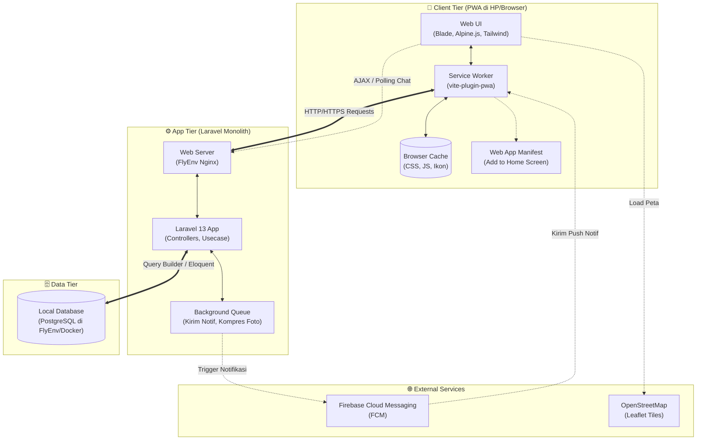
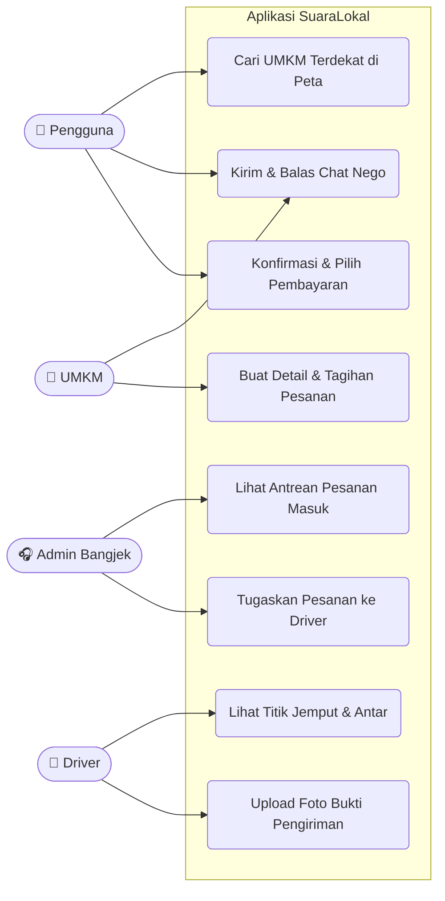
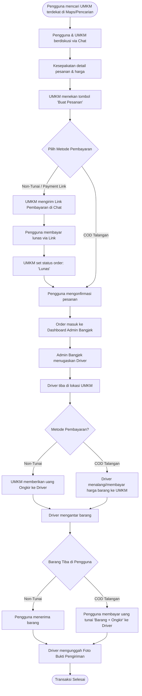
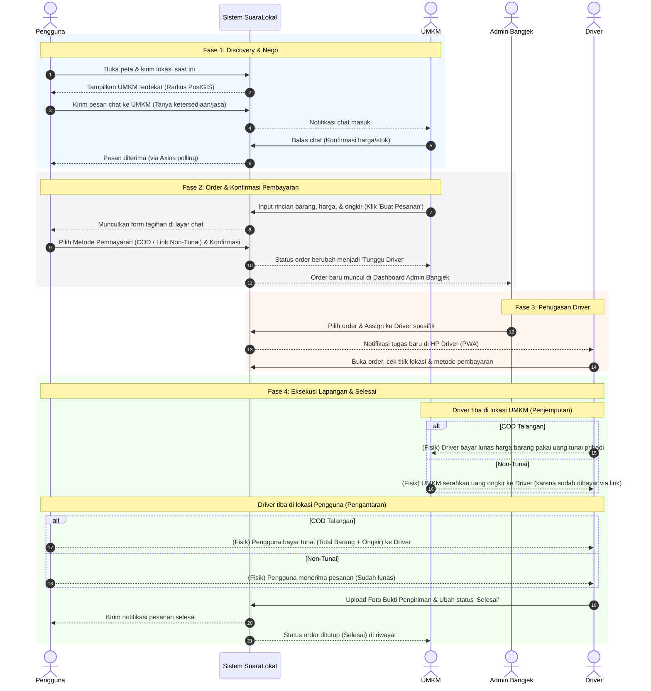
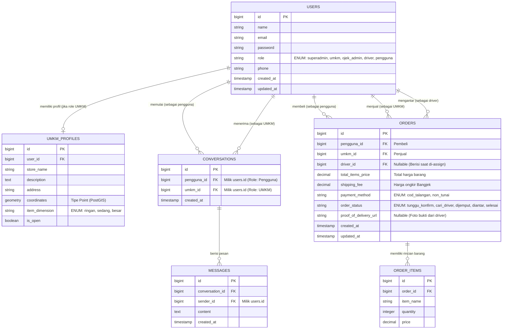
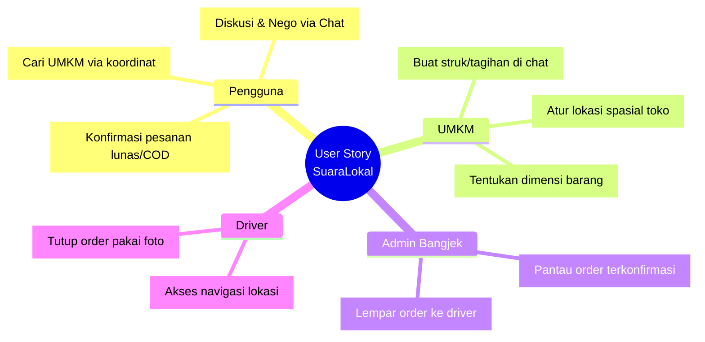

# System Design — SuaraLokal

## 1. Ringkasan Sistem

**SuaraLokal** adalah aplikasi PWA (Progressive Web App) yang menghubungkan **UMKM lokal** dengan **Pengguna** melalui fitur pencarian berbasis lokasi dan chat negosiasi, dengan layanan antar-jemput barang yang difasilitasi oleh mitra logistik **Bangjek** (Admin & Driver).

Alur inti: Pengguna mencari UMKM terdekat → negosiasi via chat → UMKM membuat pesanan → pembayaran (Non-Tunai via link atau COD Talangan) → order diteruskan ke Bangjek → driver menjemput & mengantar → bukti pengiriman diunggah → transaksi selesai.

### Aktor Sistem
| Aktor | Peran Utama |
|---|---|
| 👤 Pengguna | Mencari UMKM, chat nego, konfirmasi & bayar pesanan |
| 🏪 UMKM | Mengatur profil toko, balas chat, membuat tagihan pesanan |
| 🎧 Admin Bangjek | Memantau order masuk, menugaskan driver |
| 🛵 Driver | Menjemput & mengantar barang, upload bukti kirim |

---

## 2. Arsitektur Sistem

**Catatan arsitektur:**
- **Client Tier**: PWA agar bisa di-*install* ke home screen tanpa perlu App Store, dengan Service Worker untuk caching aset statis.
- **App Tier**: Monolith Laravel — cukup untuk skala awal, memisahkan proses berat (kompresi foto, notifikasi) ke background queue supaya request utama tetap cepat.
- **Data Tier**: PostgreSQL dipilih karena dukungan native PostGIS untuk query geospasial (cari UMKM terdekat).
- **External Services**: OpenStreetMap/Leaflet untuk peta (gratis, tanpa API key berbayar), FCM untuk push notification ke PWA.

---

## 3. Use Case Diagram

---

## 4. Alur Proses Bisnis (Flowchart)

**Poin penting logika bisnis:**
- **COD Talangan** = driver "menalangi" pembayaran barang ke UMKM di lokasi jemput, lalu ditagih kembali (barang + ongkir) ke pengguna saat serah terima. Ini artinya driver menanggung risiko dana sementara — perlu dipertimbangkan mekanisme *settlement*/reimbursement driver di modul finansial.
- **Non-Tunai** = pengguna bayar lunas via link sebelum barang dijemput; UMKM hanya perlu membayar ongkir tunai ke driver saat penjemputan.
- Foto bukti pengiriman wajib di kedua alur sebagai penutup transaksi (proof of delivery).

---

## 5. Sequence Diagram (Alur Antar Sistem)

---

## 6. Desain Basis Data (ERD)

### Catatan Skema
- Tabel `USERS` bersifat polymorphic melalui kolom `role` — satu tabel menampung 5 peran berbeda, disederhanakan lewat foreign key `pengguna_id`, `umkm_id`, `driver_id` di `ORDERS` yang semuanya merujuk ke `users.id`.
- `UMKM_PROFILES.coordinates` bertipe `geometry (Point)` agar bisa dipakai query spasial PostGIS (`ST_DWithin`, `ST_Distance`) untuk fitur "UMKM terdekat".
- `ORDERS.order_status` merepresentasikan state machine: `tunggu_konfirm → cari_driver → dijemput → diantar → selesai`.

---

## 7. User Story (Ringkasan per Aktor)

| Aktor | Sebagai... | Saya ingin... | Agar... |
|---|---|---|---|
| Pengguna | pembeli | mencari UMKM terdekat berdasarkan lokasi saya | tidak perlu mencari manual jarak jauh |
| Pengguna | pembeli | negosiasi harga/pesanan lewat chat | dapat kesepakatan sesuai kebutuhan sebelum bayar |
| UMKM | penjual | mengatur lokasi & dimensi barang toko saya | driver bisa menemukan & menangani barang dengan tepat |
| UMKM | penjual | membuat tagihan pesanan langsung dari chat | proses order lebih cepat tanpa aplikasi terpisah |
| Admin Bangjek | operator logistik | melihat semua order yang masuk dalam satu dashboard | bisa menugaskan driver secara efisien |
| Driver | kurir | melihat titik jemput & antar dengan jelas | pengiriman tidak salah alamat |
| Driver | kurir | mengunggah foto bukti pengiriman | ada bukti transaksi selesai bagi semua pihak |

---

## 8. Ringkasan Tumpukan Teknologi (Tech Stack)

| Layer | Teknologi | Alasan |
|---|---|---|
| Frontend | Blade + Alpine.js + Tailwind CSS | Ringan, cocok untuk monolith Laravel tanpa build SPA terpisah |
| PWA | vite-plugin-pwa | Install ke home screen + offline caching aset |
| Backend | Laravel 13 | Ekosistem matang, cepat untuk MVP |
| Database | PostgreSQL + PostGIS | Query geospasial native untuk pencarian UMKM terdekat |
| Queue | Laravel Queue (background job) | Memisahkan proses berat (kompresi foto, kirim notifikasi) dari request utama |
| Peta | OpenStreetMap + Leaflet | Gratis, tanpa biaya API map komersial |
| Notifikasi | Firebase Cloud Messaging (FCM) | Push notification lintas platform untuk PWA |

## 9. Potensi Pengembangan Lanjutan
- **Real-time chat**: Migrasi dari AJAX polling ke WebSocket (Laravel Reverb) untuk mengurangi latensi & beban server.
- **Rekonsiliasi dana driver**: Modul settlement untuk COD Talangan agar dana yang ditalangi driver bisa direkonsiliasi otomatis dengan Bangjek.
- **Rating & review**: Tambahan tabel `REVIEWS` untuk membangun kepercayaan antar UMKM-Pengguna.
- **Multi-driver assignment logic**: Algoritma otomatis (bukan manual admin) berdasarkan jarak & ketersediaan driver.
- **Mobile App Wrapper**: Menggunakan **PWABuilder** (Trusted Web Activity) untuk konversi instan ke `.apk` Play Store, atau **Capacitor** jika di masa depan driver membutuhkan akses hardware native tingkat lanjut (seperti background geolocation yang konstan).